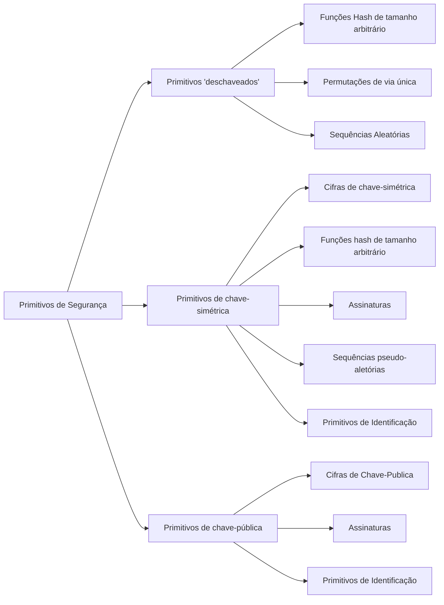

# Diagrama de Criptografia

```mermaid
graph LR

    %% Declaração dos Nós
A["Primitivos de Segurança"]
    A1["Primitivos 'deschaveados'"]
    A2["Primitivos de chave-simétrica"]
    A3["Primitivos de chave-pública"]
    A11["Funções Hash de tamanho arbitrário"]
    A12["Permutações de via única"]
    A13["Sequências Aleatórias"]
    A21["Cifras de chave-simétrica"]
    A22["Funções hash de tamanho arbitrário"]
    A23["Assinaturas"]
    A24["Sequências pseudo-aletórias"]
    A25["Primitivos de Identificação"]
    A31["Cifras de Chave-Publica"]
    A32["Assinaturas"]
    A33["Primitivos de Identificação"]

    %% Conexões
    A --> A1
    A --> A2
    A --> A3
    A1 --> A11
    A1 --> A12
    A1 --> A13
    A2 --> A21
    A2 --> A22
    A2 --> A23
    A2 --> A24
    A2 --> A25
    A3 --> A31
    A3 --> A32
    A3 --> A33

```